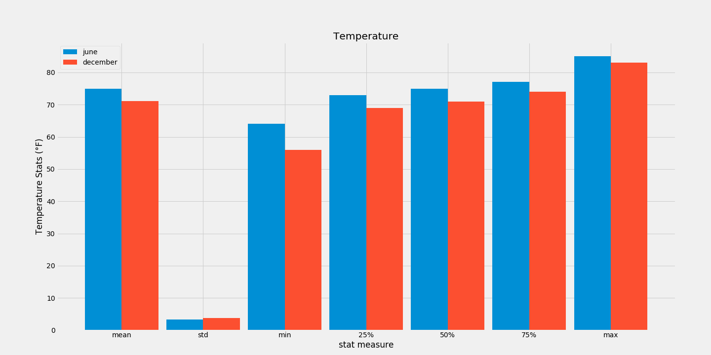

# Surfs_up - Report

## Aim

The aim of this project was to determine the viability of establishing an ice cream and surf shop on the island of Oahu, Hawaii. To accomplish this goal, the seasonal weather data of the island was analyzed for the months of June and December for the years between 2010 and 2017, inclusive. The weather data is obtained from nine (9) weather monitoring stations and stored in an sqlite database named hawaii.sqlite. 

## Key Statistical Data

### Precipitation

The statistical data that was displayed by the describe function for June and December is the following:

And following is the bar graph that shows the statistical data for both months side by side:

#### Observations

The following observations are evident from the plot:

* The mean precipitation levels for the two months are very close.

* The maximum level of precipitation for December is significantly higher than the maximum level for June.

* The quartile measures for December are higher than those for June but the differences are quite small.

* The variability of data for December is slightly higher than that for June.

### Temperature

The statistical data that was displayed by the describe function for June and December is the following:

And following is the bar graph that shows the statistical data for both months side by side:

#### Observations

The following observations are evident from the plot:

* The temperatures for June are, on average, about 4&deg;F warmer than the temperatures in December.

* The variability of the data for both months differs very slightly, by around 0.5&deg;F

* The difference between the other statistical measures range between 2&deg; and 8&deg;F.

## Recommendations

The differences between the rainfall amounts and the temperature levels between June and December on the island of Oahu are not significant such the weather can be considered temperate throughout the year. As such, I would recommend the following as venues for future analysis:

1. Investigate the prevailing economic condition of the surfer demographic to determine what price level they can afford

2. Investigate what products are popular with the surfer demographic to determine what can be sold in the surf shop to attract that type of clientele.

3. Investigate other surf shops to determine the kind of competition on Oahu and as a benchmarking effort to determine what worked for them and what didn't.
